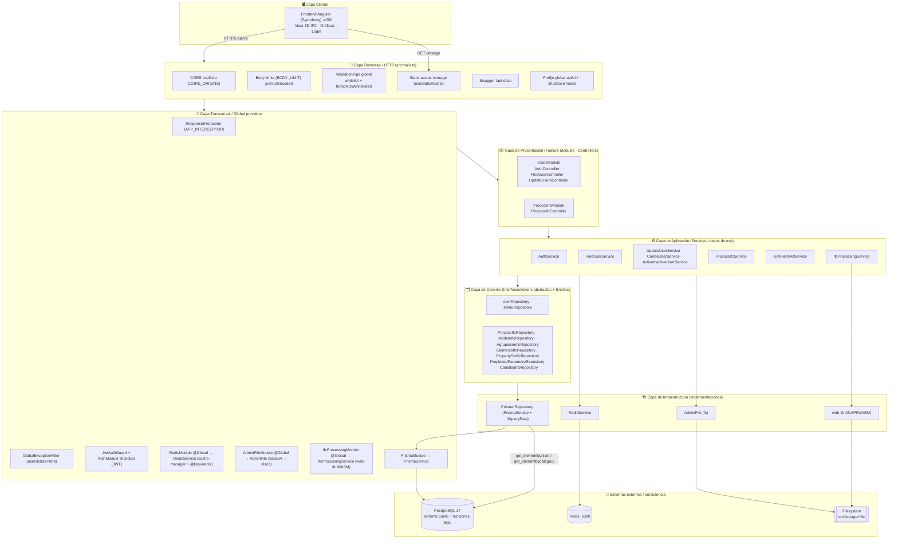
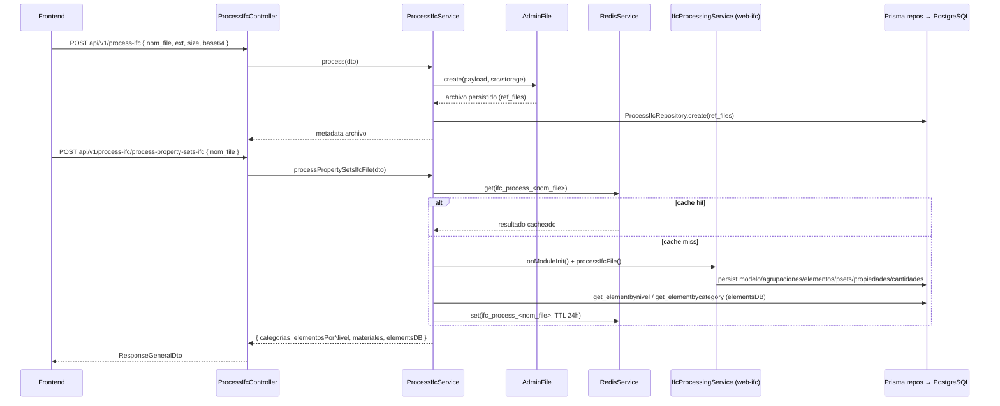
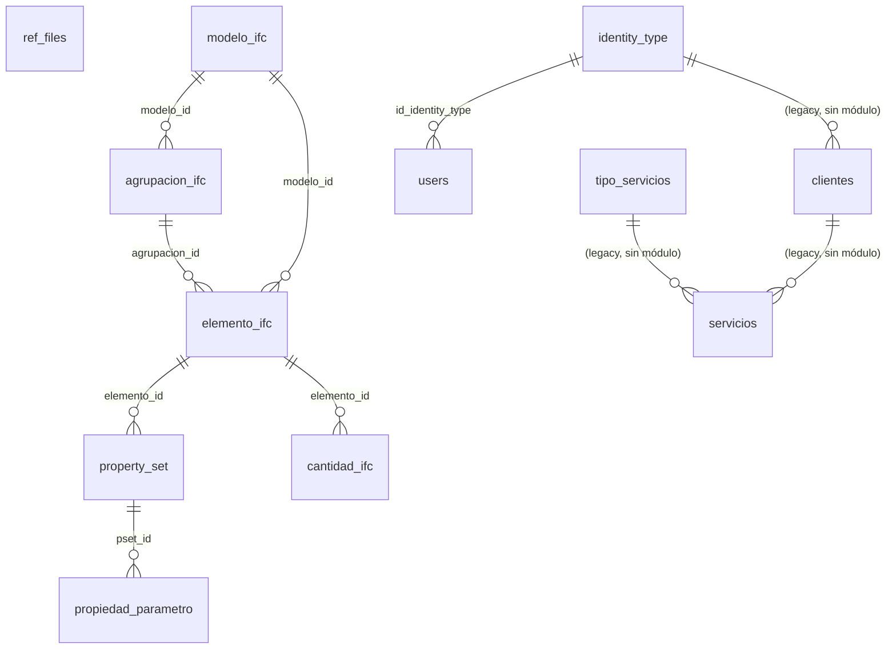

# AGENTS.md — Contexto de la aplicación (Backend Jaramillo Mora)

Documento de contexto para agentes de IA generativa y desarrolladores humanos. Debe leerse **antes** de escribir o modificar código. Complementa (no sustituye) el `README.md` operativo.

> **Estado de la evolución (importante):** este backend **nació** como una API de autenticación + CRUD de `clientes` y `servicios`, pero **evolucionó** hacia un **pipeline de procesamiento de archivos IFC (BIM/OpenBIM)**. Los módulos `clientes` y `servicios` **fueron eliminados** del código (`src/modules/`); su alcance actual gira en torno a **autenticación (users)** y **procesamiento/persistencia/consulta de modelos IFC**. Las tablas `clientes`, `servicios` y `tipo_servicios` **siguen existiendo en el schema Prisma** (reflejo de la DB), pero **no tienen módulo Nest** que las exponga.

---

## 1. Qué es este proyecto

API REST construida con **NestJS 11**, **Prisma 7** (PostgreSQL) y **Redis** (caché). Paquete npm: `auth` (`0.0.1`, privado).

Responsabilidades actuales:

1. **Autenticación JWT** de usuarios (`POST api/v1/users/auth/login`) y consulta/actualización de usuarios.
2. **Carga de archivos IFC** (y otras extensiones) enviados en **base64**, decodificados y guardados en `src/storage` y expuestos vía HTTP en `/storage`.
3. **Procesamiento IFC con `web-ifc`** (WASM): lee la estructura espacial, categorías, materiales, property sets, propiedades/parámetros y cantidades físicas de un modelo, y las **persiste** en tablas de dominio IFC.
4. **Consulta agregada para gráficas** del modelo (categorías, elementos por nivel, materiales), con **caché Redis** y agregaciones vía funciones SQL de PostgreSQL.

Datos de referencia:

- Prefijo HTTP global: `api/v1/`
- Documentación OpenAPI: `/api-docs`
- Autenticación: JWT Bearer (`JwtAuthGuard`); login público en `POST api/v1/users/auth/login`
- Respuestas HTTP con envoltorio uniforme vía `ResponseInterceptor` + `ResponseGeneralDto`
- Archivos estáticos públicos: `GET /storage/<archivo>` (para visores 3D del frontend)

---

## 2. Diagrama de arquitectura (capas)

La aplicación sigue una arquitectura **por capas + feature modules + repository pattern**, con **providers globales transversales** (auth, cache, filesystem, IFC) y **NestJS** como framework de orquestación e inyección de dependencias.



### 2.1 Flujo de procesamiento IFC (caso de uso principal)



### 2.2 Modelo de datos IFC (Prisma / PostgreSQL)



> `ref_files` guarda el archivo cargado; `modelo_ifc` y descendientes guardan el modelo parseado. `borrado en cascada` (`onDelete: Cascade`) desde `modelo_ifc` hacia agrupaciones/elementos y de ahí a psets/cantidades/propiedades.

---

## 3. Stack (versiones de referencia)

| Capa | Tecnología |
|------|------------|
| Runtime | Node.js 24 (Docker: `24.14.1-alpine`), TypeScript ^5.7 |
| Framework | NestJS ^11 (`@nestjs/common`, `core`, `platform-express`) |
| ORM | Prisma ^7.8 + `@prisma/adapter-pg` + `pg` |
| DB | PostgreSQL 17 (imagen Docker `17.x-alpine`) |
| Cache | Redis (`redis:alpine3.23`, puerto app **6390**), `@nestjs/cache-manager` + `@keyv/redis` + `cache-manager` |
| Auth | `@nestjs/jwt` + `bcrypt` |
| **IFC / BIM** | **`web-ifc` ^0.0.77 (WASM)** — parsing de modelos IFC |
| Uploads | Base64 vía body JSON (no multipart en flujo actual; `multer` presente) |
| Validación | `class-validator` / `class-transformer` (+ `zod` en deps) |
| Config | `dotenv` + `env-var` (`src/core/config/envs.ts`) — **no** se usa `ConfigModule` de Nest en el bootstrap |
| API docs | `@nestjs/swagger` |

Dependencias presentes pero **sin uso en features actuales** de `src/`: LangChain (`langchain`, `@langchain/openai`, `@langchain/core`), `@nestjs/microservices`, `@nestjs/config`. No inventar integraciones con ellas salvo que el usuario lo pida.

---

## 4. Estructura del repositorio

```
backend/
├── AGENTS.md                 # Este archivo (contexto para agentes)
├── README.md                 # Guía humana: build, dev, prod, despliegue
├── CHANGELOG.md              # Keep a Changelog (bitácora de evolución)
├── .agents/skills/           # Skills obligatorias del proyecto (ver §7)
├── src/
│  ├── main.ts                # Bootstrap: CORS, body limits, ValidationPipe, /storage, Swagger, filtros
│  ├── app.module.ts          # Prisma, AdminFile, Users, ProcessIfc, Redis, IfcProcessing
│  ├── core/                  # Transversal (config, redis, admin-file, ifc-processing, guards, filters…)
│  ├── modules/               # Feature modules (users, process-ifc)
│  └── storage/               # Archivos IFC persistidos (contenido NO versionado)
├── prisma/                   # schema.prisma, PrismaModule
├── db/plsql/                 # SQL auxiliar (funciones/consultas de referencia)
├── init-scripts/init-db.sql  # SQL de inicialización Postgres (tablas base)
├── dockerfile/api|db/        # Multi-stage API + Postgres init
├── docker-compose.yml        # Postgres, Redis, API, Redis Commander (profile tools)
├── redis/redis.conf          # Redis escucha en 6390
├── start_docker.sh           # Entrypoint contenedor API (dev, pm2)
└── scripts/embed-readme.mjs  # Embed de README en build (docs:build)
```

### 4.1 Patrón de un feature module (obligatorio)

Organizar por **feature / caso de uso**, no por capa técnica global. Referencia canónica actual: `src/modules/process-ifc/`.

```
src/modules/<feature>/
├── <feature>.module.ts
├── controllers/
│  ├── <usecase>/<usecase>.controller.ts
│  ├── dto/int/                 # DTOs de entrada (class-validator + Swagger)
│  ├── dto/out/                 # DTOs de salida
│  └── mappers/                 # Entity ↔ DTO
├── services/<usecase>/         # Un servicio por use-case (SRP)
├── repositories/               # Implementación Prisma
├── interfaces/                 # Clase abstracta / token del repositorio
└── entities/                   # Entidades de dominio ligeras
```

Registro del repositorio (token abstracto + implementación):

```typescript
{ provide: ProcessIfcRepository, useClass: PrismaProcessIfcRepository }
```

Tras crear un módulo nuevo: importarlo en `src/app.module.ts`.

> **Patrón IFC (persistencia multi-tabla):** cada tabla del dominio IFC tiene su **propio micro-módulo** (`modelo-ifc.module.ts`, `agrupacion-ifc.module.ts`, `elemento-ifc.module.ts`, `property-set-ifc.module.ts`, `propiedad-parametro.module.ts`, `cantidad-ifc.module.ts`) que **solo** expone su repositorio (token + Prisma impl). `IfcProcessingModule` (global) los importa y expone `IfcProcessingService`, evitando dependencia circular con `ProcessIfcModule`. **Respetar este patrón** al añadir tablas IFC.

### 4.2 Core transversal (no mover a features)

| Área | Ruta | Uso |
|------|------|-----|
| Envs | `src/core/config/envs.ts` | Variables tipadas; añadir aquí nuevas keys (`BODY_LIMIT`, `CORS_ORIGINS`, `REDIS_*`) |
| Auth JWT | `src/core/config/auth.module/` | `@Global`; `forwardRef(() => UsersModule)`; exporta `AuthService`, `JwtAuthGuard`, `JwtModule` |
| Guard | `src/core/guards/jwt-auth.guard.ts` | `@UseGuards(JwtAuthGuard)` + `@ApiBearerAuth('JWT-auth')` |
| Filter | `src/core/exceptions/global-exception.filter.ts` | Ya global en `main.ts` (`useGlobalFilters`) |
| Interceptor | `src/core/interceptors/response.interceptor.ts` | Ya global en `AppModule` (`APP_INTERCEPTOR`) |
| Redis | `src/core/redis/` | `RedisModule` global; `RedisService` envuelve `CACHE_MANAGER` (`set/get/del/reset/remember/increment/exists`) |
| AdminFile | `src/core/admin-file/` | `AdminFileModule` global; `adminFile.create(payload, ruta)`, `existFile(...)` (base64 → disco, con sanitización de nombre/ruta) |
| IFC processing | `src/core/ifc-processing/` | `IfcProcessingModule` global; `IfcProcessingService.processIfcFile(...)` con `web-ifc` (WASM) |
| Prisma | `src/core/database/prisma.service.ts` (+ `prisma/prisma.module.ts`) | `PrismaService` inyectable; soporta `$queryRaw` a funciones SQL |
| Validators | `src/core/validators/` | `IsNotBlank`, `IsOnlyNumbers` — reutilizar en DTOs |
| DTO base | `src/core/dto/responsegeneral.dto.ts` | `ResponseGeneralDto` + `swaggerSchema(...)` para Swagger |
| Docs | `src/core/docs/readme.generated.ts` | README embebido (generado por `docs:build`) |
| Storage | `src/storage/` | Archivos creados por `AdminFile` / consumidos por `web-ifc` (contenido no versionado) |

---

## 5. Convenciones de código (este repo)

1. **Idioma**: código y comentarios en español/inglés mezclado existente; nuevos mensajes de API y docs de dominio preferir **español** (coherente con Swagger actual).
2. **DTOs**: validar siempre con decoradores; el `ValidationPipe` global usa `whitelist: true` y `forbidNonWhitelisted: true`. Documentar con `@ApiProperty`.
3. **Errores**: lanzar `HttpException` / excepciones Nest desde services; no tragar errores async. En repositorios usar `handleError(error)` (`src/core/config/handleError.ts`).
4. **Auth en controllers**: prácticamente todos menos login van con `@UseGuards(JwtAuthGuard)` + `@ApiBearerAuth('JWT-auth')`.
5. **Respuestas**: devolver `{ datos, mensaje }` (o solo datos); el `ResponseInterceptor` arma `ResponseGeneralDto`. Opcional `@ResponseMessage('...')`.
6. **Swagger**: `@ApiTags`, `@ApiOperation`, esquemas con `ResponseGeneralDto.swaggerSchema(...)`.
7. **Prisma**: flujo actual = esquema **reflejado desde la DB** (`npm run prisma:generate:models` = `db pull` + `generate`). **No hay carpeta `prisma/migrations/`**; respetar ese flujo (o introducir migraciones solo si se pide explícitamente).
8. **Funciones SQL**: hay lógica de agregación en **funciones de PostgreSQL** (`get_elementbynivel`, `get_elementbycategory`) invocadas con `$queryRaw`. Deben existir en la DB (ver §6, deuda conocida). No asumir que Prisma las crea.
9. **Inyección**: constructor injection; **tokens (clases abstractas) para interfaces de repositorio**; no service locator.
10. **IFC**: `IfcProcessingService` inicializa el WASM (`SetWasmPath` + `Init()`) en `onModuleInit`; el flujo actual lo re-invoca antes de procesar. **Cerrar siempre el modelo** (`CloseModel`) en `finally`. El pipeline es **idempotente** (reutiliza registros existentes por nombre/GlobalId).
11. **No** crear "god services"; un service por use-case.
12. **No** duplicar providers globales (Prisma, Redis, Auth, AdminFile, IfcProcessing).
13. Typo histórico a preservar en config: variable JWT `SECRECT_KEY` (no renombrar sin migración de `.env`).
14. Campo DB tipográfico: `users.firts_names` (así en schema); no "corregir" sin migración real.

### 5.1 Endpoints existentes (resumen)

Base: `/api/v1/`

| Área | Método + ruta (relativa al prefijo) | Auth | Notas |
|------|--------------------------------------|------|-------|
| Auth | `POST users/auth/login` | Público | `{ login, passwd }` → `{ accessToken, user }` |
| Users | `GET users/findbyid` | JWT | Buscar usuario por id |
| Users | `GET users/findbyemail` | JWT | Buscar usuario por email |
| Users | `PATCH users/update_users` | JWT | Actualizar usuario |
| Process IFC | `POST process-ifc` | JWT | Subir base64 → guarda archivo en `src/storage` + `ref_files` |
| Process IFC | `GET process-ifc/getFileIfcAll` | JWT | Lista `ref_files` con URL pública `/storage` |
| Process IFC | `POST process-ifc/process-property-sets-ifc` | JWT | Parsea IFC con web-ifc, persiste dominio y devuelve datos para graficar (cacheado) |
| Process IFC | `GET process-ifc/resetcache` | JWT | Limpia toda la caché Redis |

Detalle exacto de paths/DTOs: leer controllers respectivos o Swagger en runtime.

---

## 6. Estado real vs deuda conocida (validación)

### Implementado y usable

- Bootstrap Nest (CORS explícito, body limits, pipes, filtro global, shutdown hooks, Swagger, `/storage` estático).
- Login JWT + guard + `AuthModule` global (con `forwardRef` Users↔Auth).
- Users: login, findbyid, findbyemail, update.
- **Carga IFC/base64** → `src/storage` + `ref_files` (`AdminFile`).
- **Pipeline IFC completo** (`IfcProcessingService` + `web-ifc`): modelo, agrupaciones (estructura espacial), elementos, property sets, propiedades/parámetros y cantidades físicas; **idempotente**.
- **Consulta para gráficas** con caché Redis (`ifc_process_<nom_file>`, TTL 24h) y agregación por funciones SQL (`elementsDB`).
- `RedisModule` / `RedisService` (set/get/del/reset/remember/increment/exists) sobre `cache-manager` + `@keyv/redis`.
- Infra Docker Compose: Postgres (`5453→5432`), Redis (`6390`), API (`3050`), Redis Commander (profile `tools`).
- Embed de README en build (`docs:build` → `src/core/docs/readme.generated.ts`).

### Huecos / riesgos (no asumir que existen)

| Ítem | Detalle |
|------|---------|
| Funciones SQL IFC | `get_elementbynivel` / `get_elementbycategory` se invocan con `$queryRaw` pero **no** están en `init-scripts/init-db.sql`. Deben crearse manualmente en la DB (referencia en `db/plsql/`). Sin ellas, `process-property-sets-ifc` falla al agregar `elementsDB`. |
| `clientes` / `servicios` | Tablas presentes en `schema.prisma` (reflejo DB) pero **sin módulo Nest**. No re-crear sus features salvo petición. |
| `CreateUserController` | Existe (`controllers/dto/createuser.controller.ts`) pero **no** está en `UsersModule.controllers` → create/active-inactive **no expuestos** por HTTP. |
| `MenuRepository` | `PrismaMenuRepository` referencia lógica/schema `auth.*` no presente en el schema Prisma actual; no ampliar. |
| Tests | Sin `*.spec.ts` en `src/`; plantilla e2e en `test/`. |
| Rate limiting / refresh token | No implementados. |
| Compose producción API | `api-auth-jm` usa target Docker `development` (bind mounts + pm2), no `production`. |
| `web-ifc` reinit | `processPropertySetsIfcFile` llama `onModuleInit()` en cada request; funcional pero re-crea la `IfcAPI`. |
| README embebido previo | Contenido antiguo posible; tras editar README ejecutar `npm run docs:build`. |

Al generar código nuevo: **alinear con el patrón `process-ifc` / `users`**; no reintroducir `clientes`/`servicios` ni schemas multi-tenant/menú SQL salvo que existan en DB y se pidan.

---

## 7. Skills del proyecto (`.agents/`) — obligatorias

Antes de cambios sustanciales, los agentes deben aplicar estas skills:

| Skill | Ruta | Cuándo usarla |
|-------|------|----------------|
| **nestjs-best-practices** | `.agents/skills/nestjs-best-practices/SKILL.md` (+ reglas en `rules/`, compendio `AGENTS.md`) | Cualquier escritura/revisión Nest: módulos, DI, seguridad, errores, DB, API, performance |
| **commiter** | `.agents/skills/commiter/skill.md` | Solo cuando el usuario pida commit: Conventional Commits, header ≤50 chars, body obligatorio |
| **changelog-manager** | `.agents/skills/changelog-manager/skill.md` | Junto a commits: actualizar `CHANGELOG.md` (Keep a Changelog) bajo `[Unreleased]` con timestamp |
| **skill-creator** | `.agents/skills/skill-creator/SKILL.md` | Solo si se pide crear/mejorar skills |

### 7.1 Reglas NestJS prioritarias para este repo

Fuente: `.agents/skills/nestjs-best-practices/` (40 reglas). Priorizar al generar código:

1. **Architecture (CRITICAL):** feature modules; evitar ciclos (hay `forwardRef` Auth↔Users, y micro-módulos IFC para romper ciclos — no ampliar ciclos); SRP; repository pattern (ya usado); exports correctos.
2. **DI (CRITICAL):** constructor injection; tokens (clases abstractas) de interfaz; no service locator.
3. **Errors (HIGH):** HttpExceptions desde services; filtro global ya presente; async correcto; `handleError` en repos.
4. **Security (HIGH):** JWT + guards; validar DTOs; considerar rate limiting en nuevos endpoints sensibles; `AdminFile` ya sanitiza nombre/ruta.
5. **Performance:** usar Redis/cache donde aporte (ya en IFC); evitar N+1 en repos Prisma; cerrar modelos web-ifc.
6. **Database:** transacciones en operaciones multi-paso; respetar flujo Prisma del proyecto (db pull, sin migrations).
7. **API:** DTOs int/out, interceptors, versionado (`api/v1/`).
8. **DevOps:** graceful shutdown ya habilitado; logging con `Logger` de Nest y utilidades de `core/config`; no hardcodear secretos.

Al dudar entre "atajo" y regla del skill Nest: **gana la regla del skill**.

### 7.2 Flujo de commit (si el usuario lo solicita)

1. Actualizar `CHANGELOG.md` con skill `changelog-manager`.
2. Commit con formato `commiter` (Conventional Commits).
3. No pushear ni forzar historial salvo petición explícita.
4. No commitear `.env`, secretos ni contenido de `src/storage`.

---

## 8. Cómo extender (checklist para agentes)

### Feature de negocio / endpoint nuevo

1. Crear `src/modules/<feature>/` con la estructura de §4.1.
2. Interfaz (clase abstracta = token) del repositorio + `Prisma*Repository` usando `PrismaService`.
3. Services por use-case; controllers delgados (mapeo DTO ↔ entity).
4. Importar `AuthModule` y proteger con `@UseGuards(JwtAuthGuard)` + `@ApiBearerAuth('JWT-auth')` salvo endpoints públicos justificados.
5. Registrar el módulo en `AppModule`.
6. Si hay tablas nuevas en Postgres: aplicar SQL/init y regenerar Prisma (`npm run prisma:generate:models`).
7. Documentar Swagger en el controller (`@ApiOperation`, `@ApiResponse` con `ResponseGeneralDto.swaggerSchema`).
8. Si se usa caché: inyectar `RedisService` (módulo global).
9. Actualizar este `AGENTS.md` y `README.md` si cambia arquitectura, envs o flujos de arranque.
10. Ejecutar `npm run lint` (y tests si existen).

### Nueva tabla del dominio IFC

1. Reflejarla en `schema.prisma` (`npm run prisma:generate:models`).
2. Crear su micro-módulo `<tabla>-ifc.module.ts` (token abstracto `*Repository` + `Prisma*Repository`).
3. Exportar el repositorio e importar el micro-módulo en `IfcProcessingModule`.
4. Inyectar el repositorio en `IfcProcessingService` y añadir su `getInfoByTable*` idempotente.
5. Si requiere agregación para gráficas, crear la función SQL correspondiente (patrón `get_elementby*`) y consumirla vía `$queryRaw` en `PrismaProcessIfcRepository`.

---

## 9. Configuración y runtime (resumen agentes)

Variables definidas en `src/core/config/envs.ts` (plantilla: `.env.example`):

- **HTTP:** `SERVER_PORT`, `HOST`, `BODY_LIMIT` (límite body base64, ej. `100mb`), `CORS_ORIGINS` (coma-separado; incluye `http://localhost:4200`)
- **Postgres:** `DB_HOST`, `DB_PORT`, `DB_DATABASE`, `DB_USER`, `DB_PASSWORD`, `DATABASE_URL`, `POSTGRES_DATA_PATH` (bind volume compose)
- **JWT:** `DURATION_TOKEN`, `SECRECT_KEY` (typo histórico intencional)
- **Redis:** `REDIS_HOST`, `REDIS_HOST_DOCKER`, `REDIS_PORT` (**6390**, alineado con `redis/redis.conf`), `REDIS_PASSWORD`, DBs lógicas (`REDIS_DB`/`SESSION_DB`/`CACHE_DB`), `REDIS_TTL`, `REDIS_MAX_ITEMS`, límites de memoria y paths, `REDIS_COMMANDER_PORT`

Compose sobrescribe en el servicio API: `REDIS_HOST=redis-cache-jm`, `DB_HOST=postgres-db-jm`, `DB_PORT=5432`, `DATABASE_URL`, `SERVER_PORT=3050`, `HOST=0.0.0.0` (dentro de la red Compose no existe `localhost` de otros servicios).

Puertos habituales:

| Servicio | Host |
|----------|------|
| API (compose y `.env.example`) | 3050 |
| Postgres | 5453 → 5432 |
| Redis | 6390 |
| Redis Commander | 8091 (profile `tools`) |
| Frontend Angular (consumidor) | 4200 |

Scripts npm clave: `start:dev`, `build`, `start:prod`, `prisma:generate:models`, `docs:build`, `lint`, `test`.

Detalle operativo completo: **`README.md`**.

---

## 10. Principios de colaboración agente ↔ repo

- Preferir cambios mínimos y alineados al patrón existente (`process-ifc` / `users`).
- No refactorizar masivo ni "limpiar typo de envs/schema" sin pedido.
- No reintroducir `clientes`/`servicios` ni el menú SQL legacy salvo petición explícita.
- No generar exploits, malware ni atacar sistemas.
- No inventar endpoints, tablas o skills no pedidas.
- Ante conflicto: código real del repo > este documento > supuestos genéricos Nest.
- Tras editar `README.md`, recordar que `prebuild`/`docs:build` embebe su contenido.

---

## 11. Referencias rápidas de archivos

- Bootstrap: `src/main.ts`, `src/app.module.ts`
- Envs: `src/core/config/envs.ts`, `.env.example`
- Schema: `prisma/schema.prisma`
- Feature ejemplo: `src/modules/process-ifc/`, `src/modules/users/`
- IFC engine: `src/core/ifc-processing/ifc-processing.service.ts`
- Cache: `src/core/redis/redis.service.ts`
- Files: `src/core/admin-file/admin-file.service.ts`
- Docker: `docker-compose.yml`, `dockerfile/api/Dockerfile`, `start_docker.sh`
- SQL: `init-scripts/init-db.sql`, `db/plsql/`
- Skills Nest: `.agents/skills/nestjs-best-practices/SKILL.md`
